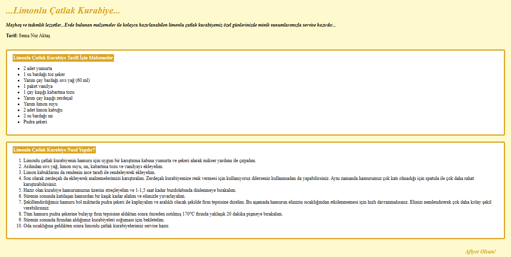

# **_...Limonlu Çatlak Kurabiye..._**
**_Mayhoş ve tadımlık lezzetler...Evde bulunan malzemeler ile kolayca hazırlanabilen limonlu çatlak kurabiyemiz özel günlerinizde minik sunumlarımızla servise hazırdır..._**

**Tarif:** Sema Nur Aktaş

### **Limonlu Çatlak Kurabiye Tarifi İçin Malzemeler**
* 2 adet yumurta
* 1 su bardağı toz şeker
* Yarım çay bardağı sıvı yağ (60 ml)
* 1 paket vanilya
* 1 çay kaşığı kabartma tozu
* Yarım çay kaşığı zerdeçal
* Yarım limon suyu
* 2 adet limon kabuğu
* 2 su bardağı un
* Pudra şekeri

### **Limonlu Çatlak Kurabiye Nasıl Yapılır?**
1. Limonlu çatlak kurabiyenin hamuru için uygun bir karıştırma kabına yumurta ve şekeri alarak mikser yardımı ile çırpalım.
2. Ardından sıvı yağ, limon suyu, un, kabartma tozu ve vanilyayı ekleyelim.
3. Limon kabuklarını da rendenin ince tarafı ile rendeleyerek ekleyelim.
4. Son olarak zerdeçalı da ekleyerek malzemelerimizi karıştıralım. Zerdeçalı kurabiyemize renk vermesi için kullanıyoruz dilerseniz kullanmadan da yapabilirsiniz. Aynı zamanda hamurumuz çok katı olmadığı için spatula ile çok daha rahat karıştırabilirsiniz.
5. Hazır olan kurabiye hamurumuzun üzerini streçleyelim ve 1-1,5 saat kadar buzdolabında dinlenmeye bırakalım.
6. Sürenin sonunda katılaşan hamurdan bir kaşık kadar alalım ve elimizle yuvarlayalım.
7. Şekillendirdiğimiz hamuru bol miktarda pudra şekeri ile kaplayalım ve aralıklı olacak şekilde fırın tepsisine dizelim. Bu aşamada hamurun elinizin sıcaklığından etkilenmemesi için hızlı davranmalısınız. Elinizi nemlendirerek çok daha kolay şekil verebilirsiniz.
8. Tüm hamuru pudra şekerine bulayıp fırın tepsisine aldıktan sonra önceden ısıtılmış 170°C fırında yaklaşık 20 dakika pişmeye bırakalım.
9. Sürenin sonunda fırından aldığımız kurabiyeleri soğuması için bekletelim.
10. Oda sıcaklığına geldikten sonra limonlu çatlak kurabiyelerimiz servise hazır.

    **_Afiyet Olsun!_**
    
 
